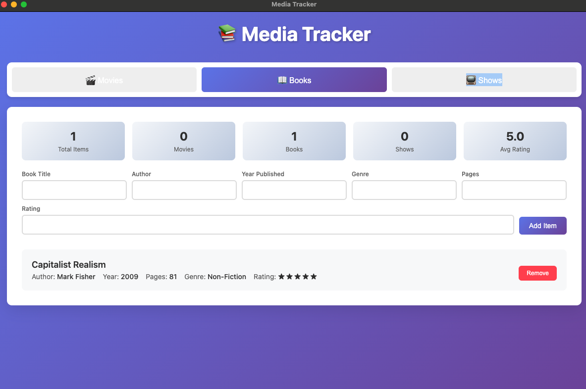
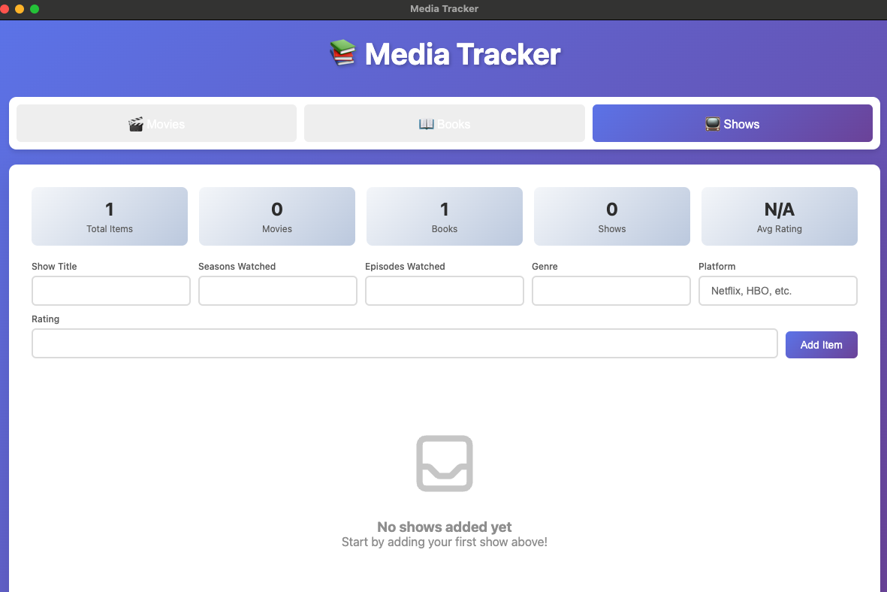

# Media Tracker

A simple desktop application built with Electron to help you track and organize your movies, books, and TV shows.

## Features

- 📱 **Cross-platform**: Works on Windows, macOS, and Linux
- 🎬 **Movies**: Track your favorite films and watchlist
- 📚 **Books**: Keep tabs on your reading progress
- 📺 **TV Shows**: Monitor episodes and seasons
- 💾 **Local storage**: All data stored locally on your device
- 🎨 **Clean interface**: Simple and intuitive user experience

## Screenshots






## Installation

### Download Pre-built Binaries

1. Go to the [Releases](../../releases) page
2. Download the appropriate version for your operating system:
   - **Windows**: `.exe` installer
   - **macOS**: `.dmg` file
   - **Linux**: `.AppImage` file

### Build from Source

#### Prerequisites

- [Node.js](https://nodejs.org/) (version 16 or higher)
- [npm](https://www.npmjs.com/) (usually comes with Node.js)

#### Steps

1. **Clone the repository**

   ```bash
   git clone https://github.com/fiazmushfeq/media-tracker.git
   cd media-tracker
   ```

2. **Install dependencies**

   ```bash
   npm install
   ```

3. **Run in development mode**

   ```bash
   npm run dev
   ```

4. **Build for production**
   ```bash
   npm run build
   ```

## Usage

1. **Launch the application**
2. **Add media items**: Click the "Add" button to include new movies, books, or TV shows
3. **Track progress**: Update your viewing/reading status
4. **Organize**: Sort and filter your collection
5. **Search**: Find specific items in your library

## Development

### Project Structure

```
media-tracker/
├── main.js          # Main Electron process
├── preload.js       # Preload scripts for security
├── renderer.js      # Renderer process logic
├── index.html       # Main application UI
├── icon.png         # Application icon
└── package.json     # Project configuration
```

### Available Scripts

- `npm start` - Run the application in production mode
- `npm run dev` - Run the application in development mode
- `npm run build` - Build the application for distribution
- `npm run dist` - Create distribution packages without publishing

### Building for Distribution

To create distributable packages for all platforms:

```bash
npm run build
```

The built applications will be available in the `dist` folder.

## Contributing

We welcome contributions! Here's how you can help:

1. **Fork the repository**
2. **Create a feature branch**: `git checkout -b feature/amazing-feature`
3. **Make your changes**
4. **Commit your changes**: `git commit -m 'Add amazing feature'`
5. **Push to the branch**: `git push origin feature/amazing-feature`
6. **Open a Pull Request**

### Development Guidelines

- Follow existing code style
- Test your changes thoroughly
- Update documentation as needed
- Write clear commit messages

## Tech Stack

- **[Electron](https://www.electronjs.org/)** - Desktop application framework
- **HTML/CSS/JavaScript** - Frontend technologies
- **Node.js** - Runtime environment

## Roadmap

- [ ] Export/import functionality
- [ ] Ratings and reviews
- [ ] Integration with external APIs (TMDB, Goodreads)
- [ ] Dark/light theme toggle
- [ ] Statistics and analytics
- [ ] Cloud sync capabilities

## License

This project is licensed under the MIT License - see the [LICENSE](LICENSE) file for details.

## Support

If you encounter any issues or have questions:

1. Check the [Issues](../../issues) page for existing problems
2. Create a new issue if your problem isn't already reported
3. Provide as much detail as possible, including:
   - Operating system
   - Application version
   - Steps to reproduce the issue

## Acknowledgments

- Built with [Electron](https://www.electronjs.org/)
- Powered in part by [ChatGPT](https://openai.com/chatgpt) and [Claude](https://claude.ai/) for code suggestions and documentation help
- Thanks to all contributors who help improve this project

---

**Enjoy tracking your media collection! 🎬📚📺**
